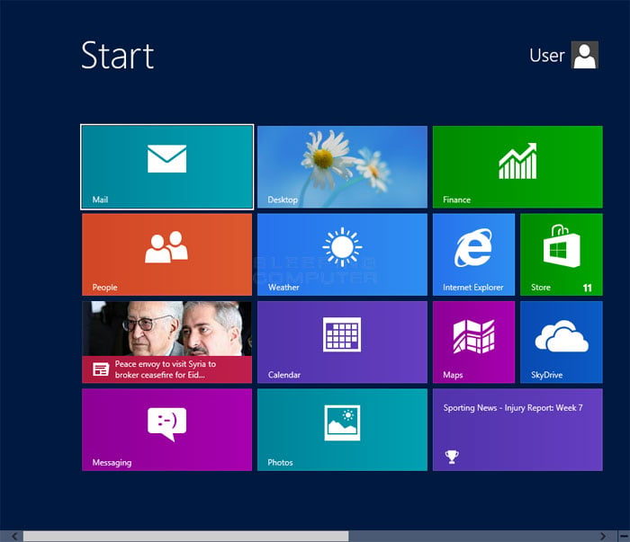
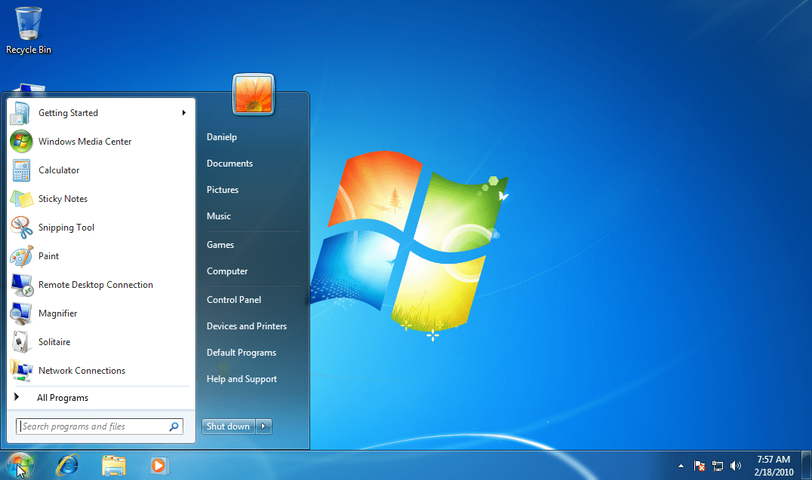

# Homework 1

## Problem 1

> Why is designing a beautiful interface often insufficient in creating a useful system?

Designing a beautiful interface is often insufficient because **usability requires more than aesthetics**. A system must align with users' cognitive, physical, and emotional needs. If the interface lacks intuitive navigation, accessibility, efficiency, or fails to solve real user problems, its visual appeal becomes irrelevant. That's why it is crucial to focus on user-centered design principles, ensuring the system is not only visually appealing but also functional and user-friendly.

## Problem 2

> List each one a product or system that is best suited to Vee, Plan-Do-Check-Act, and Scrum development cycles, give a very short explanation.

1. **Vee**: Aircraft Development (e.g., Boeing 787). The Vee model ensures rigorous validation at each stage, critical for complex, safety-driven systems such as airplanes.
2. **Plan-Do-Check-Act**: Toyota Car Manufacturing Assembly Lines. Plan-Do-Check-Act drives continuous improvement in manufacturing, optimizing quality and reducing waste.
3. **Scrum**: Spotify. Scrum is well-suited for software development. Scrum’s iterative sprints and adaptability allow for rapid updates and seamless integration of user feedback, making it ideal for the fast-paced environment of software development.

## Problem 3

> Look for one technology-centered product (show its picture), that failed to address HFE.

As a student from the Department of Computer Science and Technology, the first product that comes to mind is **Windows 8**.

| Windows 8 Start Screen[^1] | Windows 7 Start Menu[^2] (as a comparison) |
| :-: | :-: |
|  |  |

Windows 8 became one of Microsoft’s **least-popular** OS releases. Many users reverted to Windows 7 or installed third-party tools to restore the Start Menu. Microsoft later backtracked with Windows 8.1 and fully revived the Start Menu in Windows 10, acknowledging the HFE missteps.

Microsoft aimed to unify touch and desktop interfaces, pushing for a tablet-friendly design. However, they introduced the Metro UI, which was a drastic change from the traditional desktop. **This caused confusion among users who were accustomed to the Start Menu, which Windows 8 replaced with a full-screen Start Screen**. This disruption of established workflows was a major HFE issue.

Microsoft prioritized its vision of a "touch-centric future" over user testing. Early beta feedback about confusion and dissatisfaction with the Start Screen was largely disregarded. This oversight highlighted the importance of user-centered design principles, demonstrating that a product must meet user needs and expectations to be successful.

[^1]: Credit: [Get Back the Classic Start Menu in Windows 7](https://petri.com/classic-start-menu-in-windows-7/). Image [here](https://petri.com/wp-content/uploads/petri-imported-images/classic_start_menu_11.png).
[^2]: Credit: [Introduction to the Windows 8 Start Screen](https://www.bleepingcomputer.com/tutorials/how-to-use-windows-8-start-screen/). Image [here](https://www.bleepstatic.com/tutorials/windows-8/introduction-start-screen/windows-8-start-screen.jpg).
