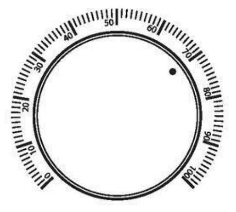
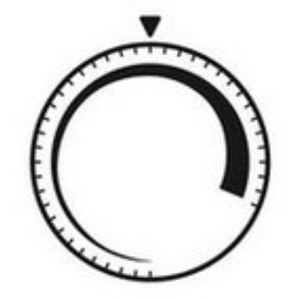

# Homework 4

## Problem 1

> 现在 LED 照明效率相比于原来的白炽灯或日光灯已经高出很多，在这种情况下，修改教室的照明标准（从 $500\;\mathrm{lx}$ 进一步提高，如 $1000\;\mathrm{lx}$），有什么问题吗？

虽然 LED 照明效率高、能耗低，但将教室照明标准从 $500\;\mathrm{lx}$ 提高到 $1000\;\mathrm{lx}$ 可能会产生以下问题：

1. **能耗增加**：尽管 LED 的能效较高，但照明标准的提升会直接导致能耗的增加，尤其是在大面积教室中，这种影响会更加显著。
2. **眩光问题**：过高的照明亮度可能会引发眩光，影响学生的视觉舒适度，甚至可能导致视觉疲劳。
3. **成本上升**：提高照明标准需要增加灯具数量或更换更高功率的灯具，这会增加初始安装成本和后续维护成本。
4. **环境影响**：更高的能耗意味着更多的能源消耗，这可能会对环境造成额外的负担，不符合节能减排的可持续发展目标。

## Problem 2

> (No need to submit) A classroom with an area of $100\;\mathrm{m}^2$, according to German DIN standard, the required illumination is $500\;\mathrm{lx}$. In order to meet this requirement, how many bulbs are at least required? (assume each bulb emits $1500\;\mathrm{lm}$ of light, and $80\%$ of the light can be effectively applied to the reading area)

To determine the number of bulbs required, we first calculate the total lumination flux needed:

$$
\Phi = 100\;\mathrm{m^2} \times 500\;\mathrm{lx} = 5 \times 10^4\;\mathrm{lm}
$$

Let $N$ be the number of light bulbs needed. Given that each bulb has an efficiency $\eta = 80\%$ and emits $\Phi_i = 1500\;\mathrm{lm}$ of light, we have:

$$
\eta N \Phi_i \ge \Phi
$$

Substituting the values:

$$
0.8 \times N \times 1500 \ge 50000
$$

Solving for $N$:

$$
N \ge \frac{50000}{1200} \approx 41.67
$$

Rounding up, we find that $N = 42$ bulbs are required.

## Problem 3

> 为什么说手机阅读可能会严重影响视力？

手机通常在距离眼睛较近的位置使用（一般约 $20$~$30\;\mathrm{cm}$），而这种近距离用眼会显著增加眼部调节负担，导致睫状肌长期紧张，引发近视或视疲劳。

而且，很多人（比如我）喜欢在睡前或在暗光环境下使用手机，此时光线对比度过大，可能引发严重的视觉疲劳。所以说，手机阅读可能会严重影响视力。

## Problem 4

> 找一个将绝对判别转化为相对判别，从而提高人们辨别能力的设计例子。

传统的音量调节旋钮通常依赖**绝对数值**（如从 $0$ 到 $100$ 的数字刻度）来指示音量大小。然而，用户在实际使用中并不总是关注具体数值，而是需要快速感知音量的变化和相对大小。单纯的数字刻度可能会让用户难以在视觉上快速判断当前音量状态和其变化趋势。

通过在音量旋钮上添加渐变标识，将音量的绝对判别转化为更直观的**相对判别**。例如，在旋钮的轨迹上使用线条粗细的变化（如从细线到粗线）来表示音量大小。用户无需记住具体的数值刻度，而是通过渐变的视觉效果感知音量的相对变化，从而更加直观和高效地调整音量。

<table style="width: 100%;">
    <thead>
        <tr>
            <th style="width: 50%;">绝对判别</th>
            <th style="width: 50%;">相对判别</th>
        </tr>
    </thead>
    <tbody>
        <tr>
            <td style="width: 50%;"></td>
            <td style="width: 50%;"></td>
        </tr>
    </tbody>
</table>
