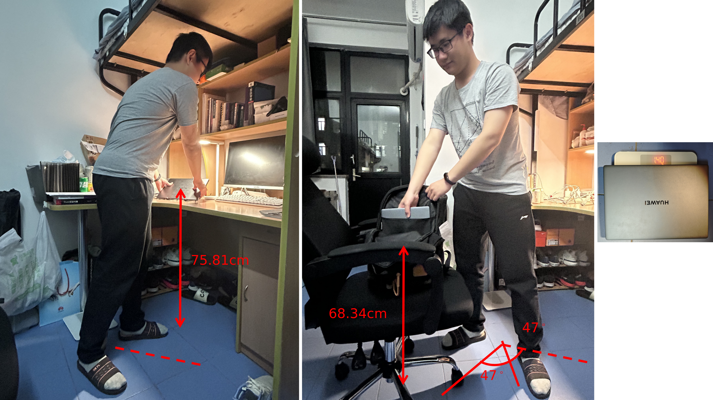

# Homework 5

## Problem 1

> Study the example problems in the Applications Manual for the Revised NIOSH Lifting Equation, and then apply the NIOSH lifting guidelines to analyze a specific manual handling task in your daily work environment.
>
> - A photo should be uploaded to show the necessary parameters in the manual handling task.
> - You are allowed to use the mobile apps available for your homework.

### Job Description

Every day before leaving my dormitory, I need to pack my backpack, particularly my laptop, which is significantly heavier than my books. The process involves unloading my laptop from my desk and placing it into my bag. During this task, I must rotate at an angle. The process and its parameters are illustrated in the figure below:

### Job Analysis

The task variable data are measured and recorded on the job analysis worksheet.
- The vertical location of the hands is $75.81\;\mathrm{cm}$ ($29.85\;\mathrm{in}$) at the origin and $68.34\;\mathrm{cm}$ at the destination (relative to the floor).
- The horizontal location of the hands is $15.7\;\mathrm{cm}$ at the origin and $16.08\;\mathrm{cm}$ at the destination (relative to the edge of the desk).
- The asymmetry angle is $47^\circ$ at the origin and $47^\circ$ at the destination of the lift.
- The frequency is less than $0.2$ lifts/min for less than $1$ hour.
- The laptop is an optimal container with no optimal handles, and fingers are not flexed 90 degrees, so the object coupling is regarded as poor.

The multipliers are computed from the lifting equation or determined
from the multiplier tables.

#### Hazard Assessment

The weight to be lifted is $1.4\;\mathrm{kg}$ ($3.086\;\mathrm{lbs}$), which is less than the WRL ($37.89\;\mathrm{lbs}$). Therefore, the LI is

$$
\frac{3.086}{37.89} = 0.081
$$

Since the Lifting Index (LI) is less than 1.0, this task is considered safe and within acceptable limits according to the NIOSH lifting guidelines. No further ergonomic intervention is required for this specific manual handling task.
