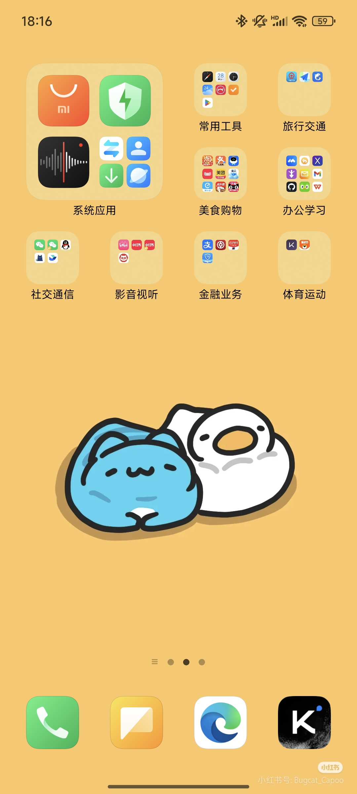
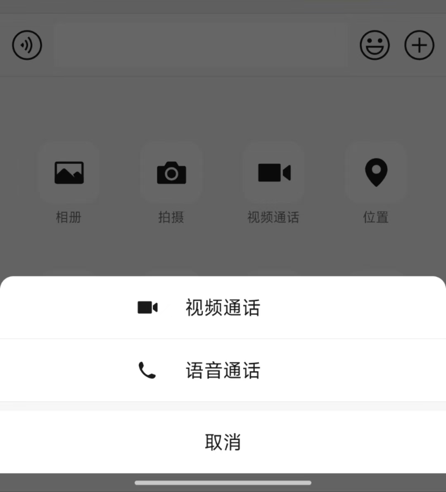

# Homework 7

## Problem 1

> Take a screenshot of your smartphone’s home screen and analyze the reasons behind the way you have organized your icons and apps.

I organize my apps into distinct groups based on their functionality. This approach minimizes the cost of information access by clustering related apps together, which aligns with the principle of **proximity compatibility**. For instance, all communication apps are placed in one folder, while productivity tools are in another. This organization reflects my mental model of app usage, making it both intuitive and efficient.

By grouping apps in this manner, I can quickly locate the desired app by first identifying its category and then searching within a smaller, more focused set of icons. This method significantly reduces the time and effort required compared to searching through all apps on a single screen.

In addition, I follow the principle of **salience compatibility** by placing the most frequently used apps in prominent positions on the screen, such as the top row or center, where they are easily noticeable. For example, *Meituan* is in the center of the group *美食购物*，and *Wechat* is the first app in the group *社交通信*. This reduces the time needed to locate these apps.

## Problem 2

> Identify two typical examples of poorly designed displays in your daily life, and explain which design principles are violated in each case. (It would be better if those cases are found in our campus.)

### 1: The Numbering of Classrooms in Tsinghua

**The numbering system for classrooms in Teaching Building No.3 violates the principle of *A3: Proximity Compatibility*.**

For example, in Teaching Buildings No.4, No.5, and No.6, classrooms are named in a straightforward manner, such as 四教4301, 五教5104, and 六教6A201. Here, **the first digit corresponds to the building number**. However, Teaching Building No.3 is divided into three sections, and the first digit indicates which section the classroom belongs to. This creates confusion when people see names like 三教1201. Why is the first digit 1 instead of 3? Does it mean the classroom is on the first floor? This ambiguity leads to disorientation.

In my opinion, the naming system used in Teaching Building No.6 is a better example. **It uses letters (A, B, and C) to identify different sections of the building.** For Teaching Building No.3, a five-character naming system could be adopted to clearly identify each classroom. For instance, instead of 三教1101, the name could be 三教3**A**101, or 三教3**1**101. This five-digit format aligns with the naming convention used in Teaching Building No.6, which also has a five-character name, such as 六教6**A**101.

### 2: WeChat's "Video Call" Button

The "Video Call" button in WeChat actually represents two functions: Phone Call and Video Call. However, the icon of the button only shows the video call function. **This violates the principle of *MM14: Principle of Pictorial Realism.***

A display should look like (i.e., be a picture of) the variable that it represents. In this case, the button is labeled with only "Video Call," and the icon resembles a camera, which is typically associated with video calls. This design fails to visually represent the additional functionality of the phone call option. Users might assume that the button is solely for video calls, without realizing that it also includes the phone call function. The lack of a distinct visual cue for the phone call feature further exacerbates the confusion.

To address this issue, the design could incorporate a more inclusive icon that represents both functionalities. For example, it could combine elements of a phone and a camera, or use a split icon to indicate the dual purpose. Additionally, the button text could be revised to something like "Call" or "Video/Audio Call" to clarify that both options are available. This would better adhere to the principle of pictorial realism by accurately representing the full range of functions the button provides.

