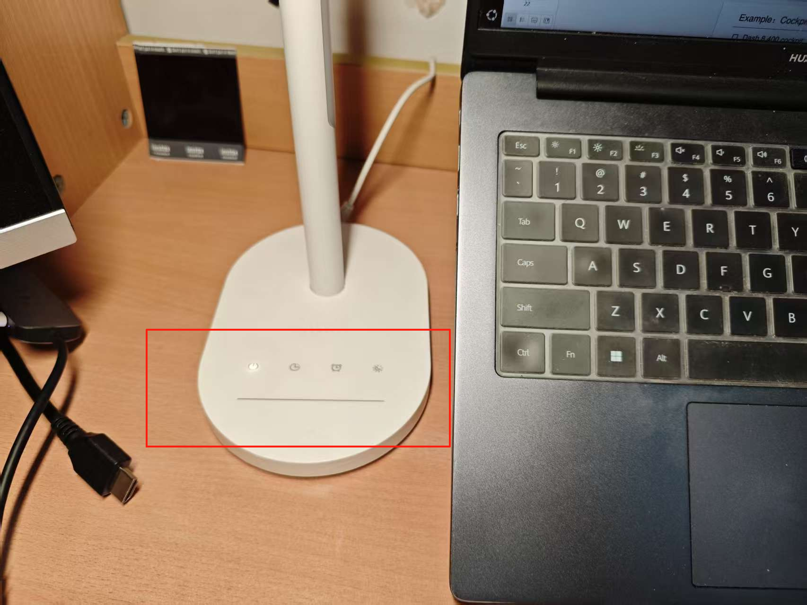
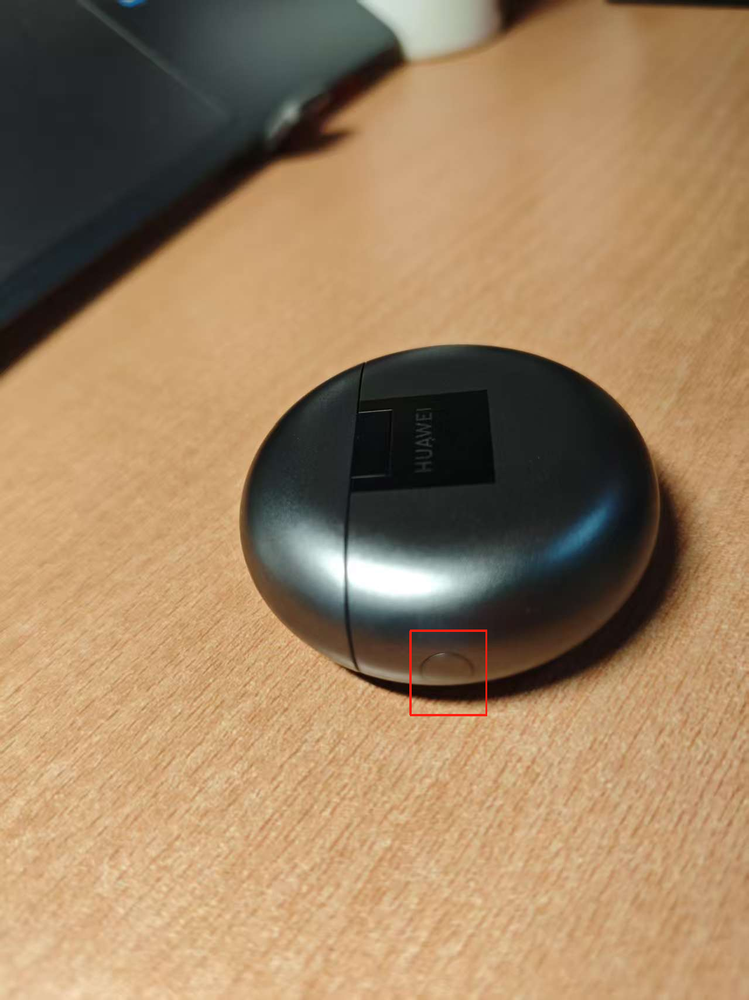

# Homework 8

## Problem 1

> Identify two or more examples in our daily study, work, and life that violate the above control design principles. These examples should be illustrated with pictures, and you need to explain which control design principles are violated and how they can be improved.

### The Brightness Adjustment Strip of the Lamp on My Desk

**Violation**

The brightness adjustment strip on this desk lamp lacks clear visual or tactile markings, such as "+", "-", directional arrows, or a gradient, to explicitly indicate its function and method of operation. **This violates the design principle *P4: Make discriminable*.**

The absence of these cues makes it difficult for a user to distinguish the interactive area for brightness control from a purely aesthetic feature or to understand how to manipulate it. Users might be unsure whether to tap, slide, or press along the strip, or even how to orient their interaction to achieve the desired increase or decrease in brightness. The method of operation is not immediately apparent or distinguishable.

**How to Improve**

To improve the discriminability of the brightness adjustment strip, several enhancements could be made:

1. **Add Clear Visual Markings:** Incorporating universally understood symbols like a "+" at one end and a "-" at the other would intuitively indicate the direction for increasing or decreasing brightness.
2. **Include Directional Cues:** Small arrows could be added to suggest a sliding or swiping motion if that is the intended method of operation.
3. **Enhance Tactile Feedback:** Subtle tactile changes along the strip, such as small raised dots, ridges, or a slightly concave groove, could help users locate and operate the control by touch, especially in low-light conditions. This would make the interactive area physically distinct from the surrounding flat surface.

### The Side Button on My Earphone Case

**Violation**

My dark-colored, rounded earphone charging case features a small, circular button on its side. The button is nearly flush with the case surface and is made of the same color and material as the case itself. This design causes the button to blend in significantly with its surroundings. **It violates the design principle *P4: Make discriminable*.**

Because the button is small, matches the case's color and texture, and is not significantly raised or otherwise differentiated, it becomes challenging to visually locate or distinguish by touch. New users, or any user in low-light conditions, might struggle to find the button quickly or even realize it is an interactive element. Its subtle design fails to clearly communicate its presence and function as a control.

**How to Improve**

Make the button a slightly different color or shade than the case. Even a subtle contrast (e.g., a darker grey button on a black case, or a metallic finish) can significantly improve visibility.
